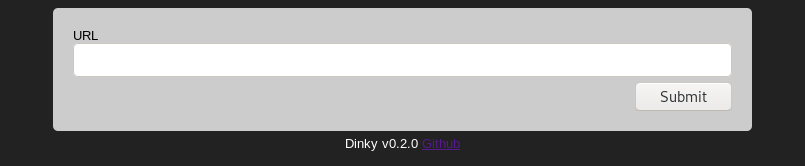

A basic, self-hosted, link shortening service.

## Install

    cargo install dinky

## Build

    git clone https://github.com/nuxeh/dinky.git
    cd dinky
    cargo build

## Test

    cargo test

## CLI options

Usage information can be provided with `--help`.

## Configuration

There is a configuration file (in TOML format), which will be created in a
default XDG path if a path is not specified with the `--conf` CLI parameter.

In the case that dinky writes out the configuration, it will be populated with
default values, and is therefore a good place to start from. The name of the
file created will be printed when `dinky` starts, it may be edited in place,
and after restart will be loaded.

### Annotated configuration options

~~~
[settings]
bind = "127.0.0.1"
port = 4444
base_url = "http://example.com/"
~~~

- Port and IP address to bind to.
- The fully qualified domain name used to generate links. This must point to
  the same path as `dinky` is being run on.

~~~
[hash]
length = 10
salt = "dinkysalt123"
~~~

- Length of the generated short link hash, and a salt to use in the hash
  generation.

~~~
[database]
kind = "Sqlite"
path = "example_db"
~~~

- Database to use. Currently only sqlite is supported.

~~~
[index]
hidden = false
html = ""
css = ""
form = ""
~~~

- Wether to hide the index page (if you don't want `dinky` to provide a
  submission form.
- Paths to an HTML template, an HTML form, and a CSS file to serve.

These are optional, and should only be used if you wish to radically change how
`dinky` looks.

Within the template HTML, `{{content}}` is replaced with the form HTML, or any
other content or messages that dinky serves. Additionally, `{{ver}}` is
replaced with the current version of d`dinky`.

## Installation as a service with Cargo and systemd

To set up systemd manually, the unit file must be copied, and the `dinky`
user must be created on the system. From inside the project repository:

    cargo install dinky
    sudo useradd -m --system dinky --shell /usr/sbin/nologin
    sudo install -D -o dinky -g dinky ~/.cargo/bin/dinky -t /home/dinky/.cargo/bin/
    sudo install -m 644 systemd/dinky.service /etc/systemd/system/
    sudo systemctl enable --now dinky.service

## Use with nginx

When being run as a service, `dinky` may be proxied using nginx, e.g. as
follows:

    location /some/path/ {
        proxy_pass http://127.0.0.1:4444/;
    }

See [the nginx docs](https://docs.nginx.com/nginx/admin-guide/web-server/reverse-proxy/).

## Preview

